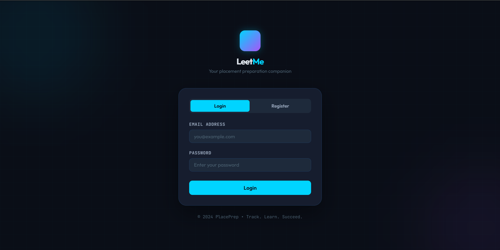
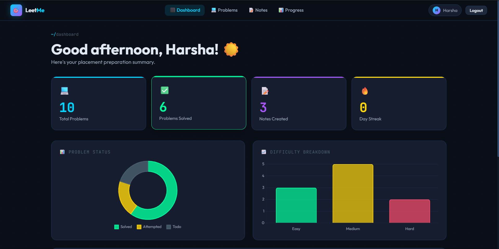
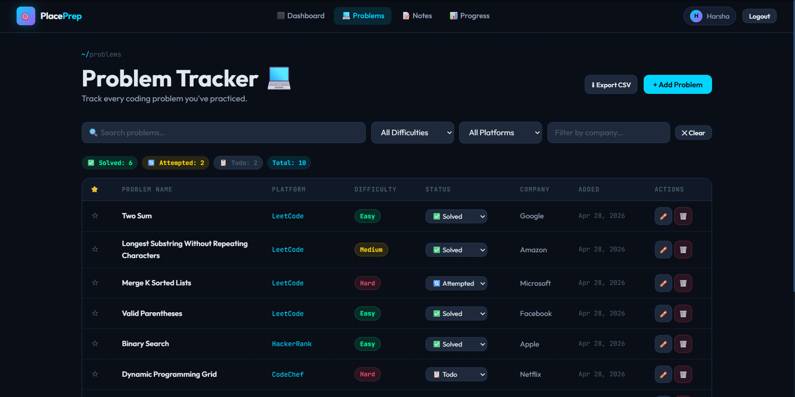
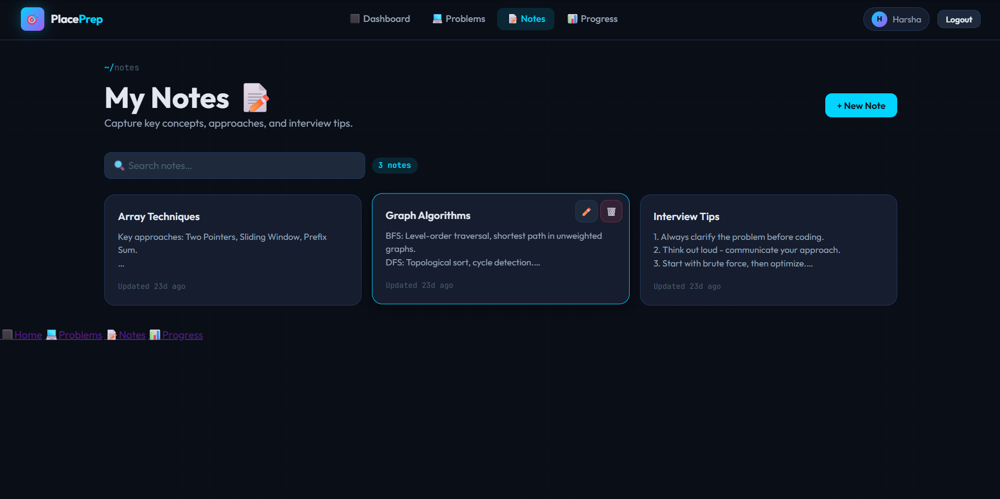
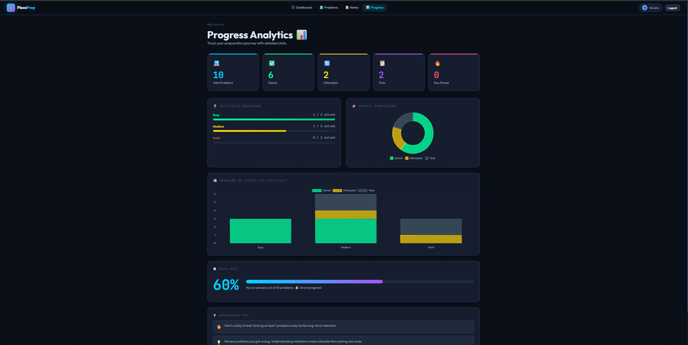

# 🎯 PlacePrep — Placement Preparation Tracker

A full-stack web application to help students track their coding practice, notes, and progress for campus placements.

---
# Placement Tracker
```
## Login Page


## Dashboard


## Problems Page


## Notes Page


## Progress Page

```

## 📁 Project Structure

```text
PlacementTracker/
├── screenshots/
├── pom.xml
├── database/
│   └── setup.sql
└── src/
    └── main/
        ├── java/com/placement/
        │   ├── model/
        │   ├── dao/
        │   ├── servlet/
        │   └── util/
        └── webapp/
            ├── index.html
            ├── dashboard.html
            ├── problems.html
            ├── notes.html
            ├── progress.html
            ├── css/
            ├── js/
            └── WEB-INF/
```
## 🗃️ Database Schema

```sql
users     (id, name, email, password, created_at)
problems  (id, user_id, problem_name, platform, difficulty, status, company, is_favorite, date_added)
notes     (id, user_id, title, content, date_created, date_updated)
daily_streak (id, user_id, solve_date, problems_solved)
```

---

## ⚙️ Setup Instructions
```
### Prerequisites
| Tool
| Java JDK 11+
| Apache Tomcat 10.x 
| MySQL  8.x 
| Maven 3.6+ 

---

### Step 1 — Set Up MySQL Database
```
1. Open MySQL Workbench or any MySQL client.
2. Run the setup script:
   ```bash
   mysql -u root -p < database/setup.sql
   ```
   Or paste the contents of `database/setup.sql` into your MySQL client.

3. Verify tables were created:
   ```sql
   USE placement_tracker;
   SHOW TABLES;
   ```
---

### Step 2 — Configure Database Connection

Open `src/main/java/com/placement/util/DBConnection.java` and update:

```java
private static final String DB_URL      = "jdbc:mysql://localhost:3306/placement_tracker...";
private static final String DB_USER     = "root";        // ← your MySQL username
private static final String DB_PASSWORD = "your_password"; // ← your MySQL password
```

---

### Step 3 — Build with Maven

```bash
cd PlacementTracker
mvn clean package
```

This creates `target/PlacementTracker-1.0-SNAPSHOT.war`

---

### Step 4 — Deploy to Tomcat

**Option A — Copy WAR file:**
```bash
cp target/PlacementTracker-1.0-SNAPSHOT.war /path/to/tomcat/webapps/PlacementTracker.war
```
Then start Tomcat:
```bash
/path/to/tomcat/bin/startup.sh        # Linux/Mac
/path/to/tomcat/bin/startup.bat       # Windows
```

### Step 5 — Access the App

Open your browser and go to:
```
http://localhost:8080/PlacementTracker/
```

**Test login credentials (from sample data):**
- Email: `harsha@gmail.com`
- Password: `123456`

> **Note:** The sample user in `setup.sql` has a plain-text password for testing. After your first real registration via the app UI, passwords are properly hashed.

---

## 🧭 Features Overview

| Feature | Description |
|---------|-------------|
| 🔐 Auth | Register/Login with SHA-256 hashed passwords |
|📊 Dashboard Analytics| Stats overview, charts, recent activity |
| 💻 Problem Tracker | Add/edit/delete/search/filter coding problems |
| ⭐ Favourites | Star important problems |
| 📝 Notes | Create/edit/delete notes with full-text search |
| 📈 Progress | Difficulty breakdown, solve rate, stacked charts |
| 🔥 Streak | Daily streak tracking |
| ⬇ Export | Export problems table to CSV |

---

## 🔌 API Endpoints (Servlet URLs)

| Method | URL | Description |
|--------|-----|-------------|
| POST | `/auth?action=login` | Login |
| POST | `/auth?action=register` | Register |
| GET | `/auth?action=logout` | Logout |
| GET | `/session` | Current session info |
| GET | `/dashboard-data` | Dashboard stats (JSON) |
| GET | `/problems` | List problems (filterable) |
| POST | `/problems?action=add` | Add problem |
| POST | `/problems?action=edit` | Edit problem |
| POST | `/problems?action=delete` | Delete problem |
| POST | `/problems?action=star` | Toggle favourite |
| GET | `/notes` | List notes |
| POST | `/notes?action=add` | Add note |
| POST | `/notes?action=edit` | Edit note |
| POST | `/notes?action=delete` | Delete note |

---

## 🛡️ Security Notes

- Passwords are hashed with **SHA-256 + salt** before storage
- All DB queries use **PreparedStatement** (SQL injection safe)
- Session-based authentication with **30-minute timeout**
- Each DAO query checks `user_id` to prevent cross-user data access

---

## 🐛 Common Issues

| Problem | Solution |
|---------|----------|
| `ClassNotFoundException: com.mysql.cj.jdbc.Driver` | Add mysql-connector-java JAR to classpath / Maven dependency |
| `Access denied for user 'root'@'localhost'` | Check DB_USER and DB_PASSWORD in DBConnection.java |
| `Table 'placement_tracker.users' doesn't exist` | Run `database/setup.sql` in MySQL |
| 404 on all pages | Check context path in Tomcat and ensure WAR deployed correctly |
| Port 8080 in use | Change Tomcat port in `conf/server.xml` or stop conflicting service |

---

## 📦 Dependencies

| Library | Version | Purpose |
|---------|---------|---------|
| javax.servlet-api | 4.0.1 | Servlet support |
| mysql-connector-java | 8.0.33 | JDBC driver |
| gson | 2.10.1 | JSON serialization |
| Chart.js | 4.4.0 | Frontend charts (CDN) |

---

## 🎨 Tech Stack

- **Backend:** Java 11 + Servlets (MVC pattern)
- **Database:** MySQL 8 with JDBC
- **Frontend:** HTML5, CSS3 (CSS Variables), Vanilla JavaScript
- **Charts:** Chart.js
- **Build:** Maven
- **Server:** Apache Tomcat 9/10

---
## Future Improvements

- Dark Mode
- Coding Streak Graphs
- Online Judge API Integration
- AI-based Recommendations

*Built for placement prep. Track. Practice. Succeed. 🚀*
=======
# PlacementTracker
Full-stack Java web application for placement preparation tracking with problem management, notes, analytics, streaks, and progress dashboard using Servlets, MySQL, Maven, and Tomcat.
